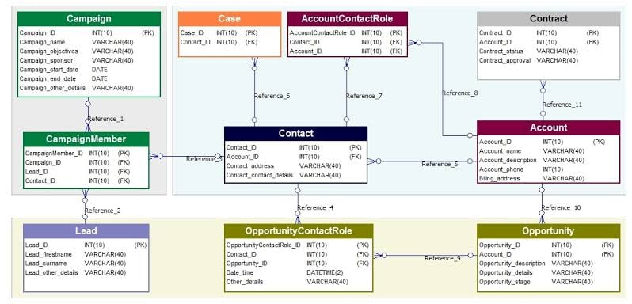

# Aylin Yıldız - Ödev 1
 

## Ödev 1 :

📌 Resimdeki CRM database model örneğine göre database oluşturuldu.  
📌 Tablolar arası ilişki kuruldu.  
📌.bak, .sql formatı ve MSSQL veri tabanı diyagramı yüklendi. 

  

## Ödev 2 :

📌Entity katmanında bulunan Model klasörü altındaki class'ların Dto class'ları oluşturuldu ve MappingProfile yapısına eklendi.

